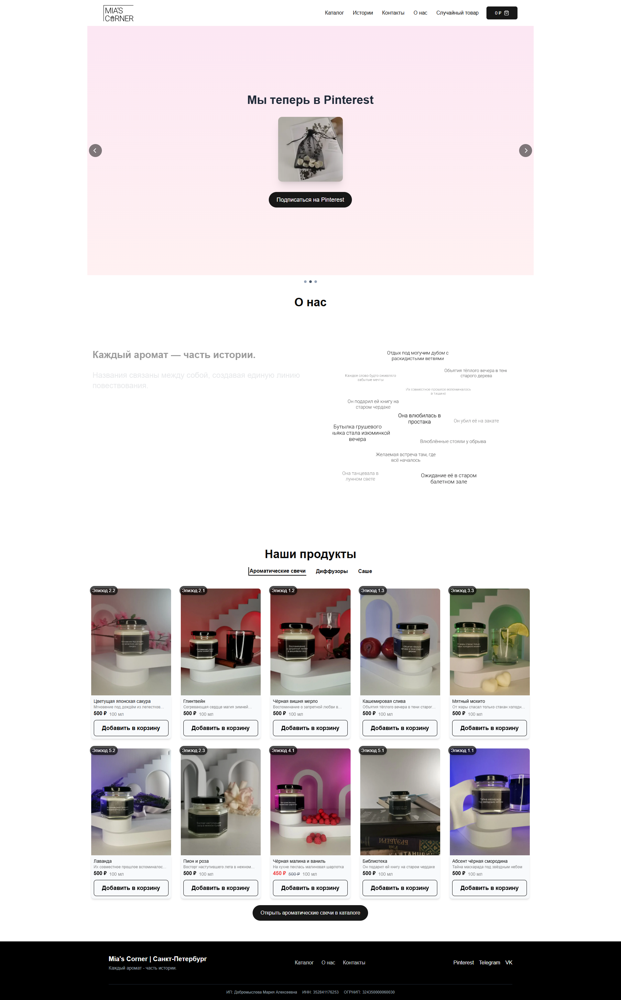
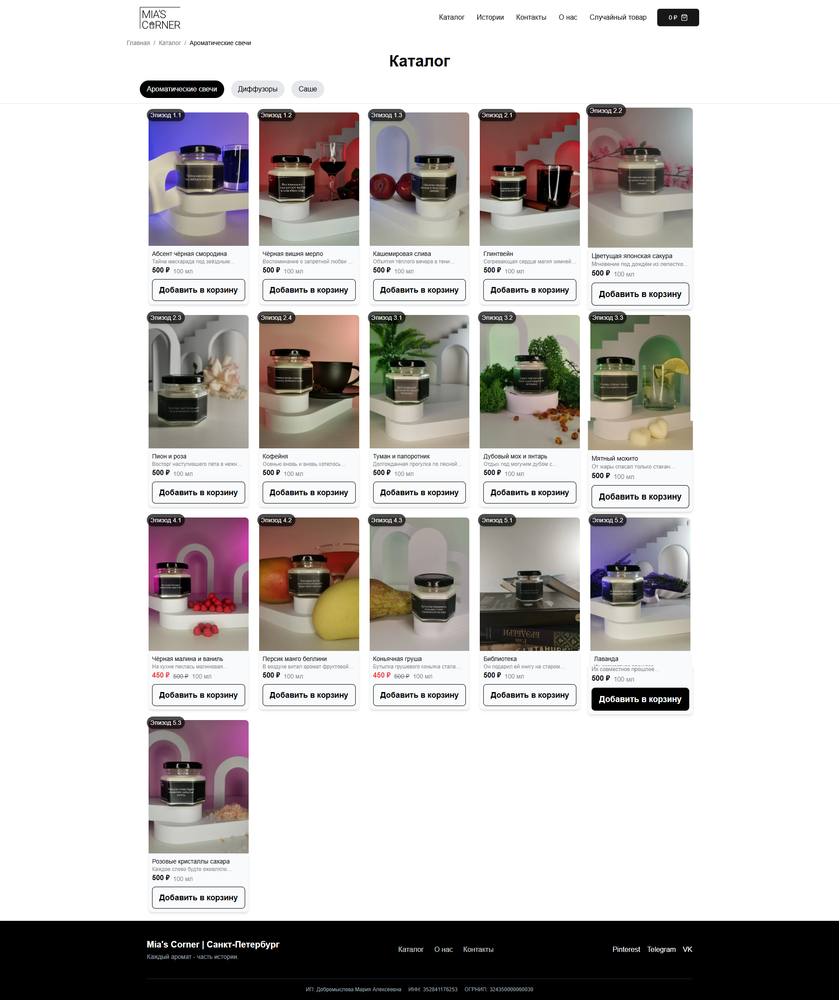
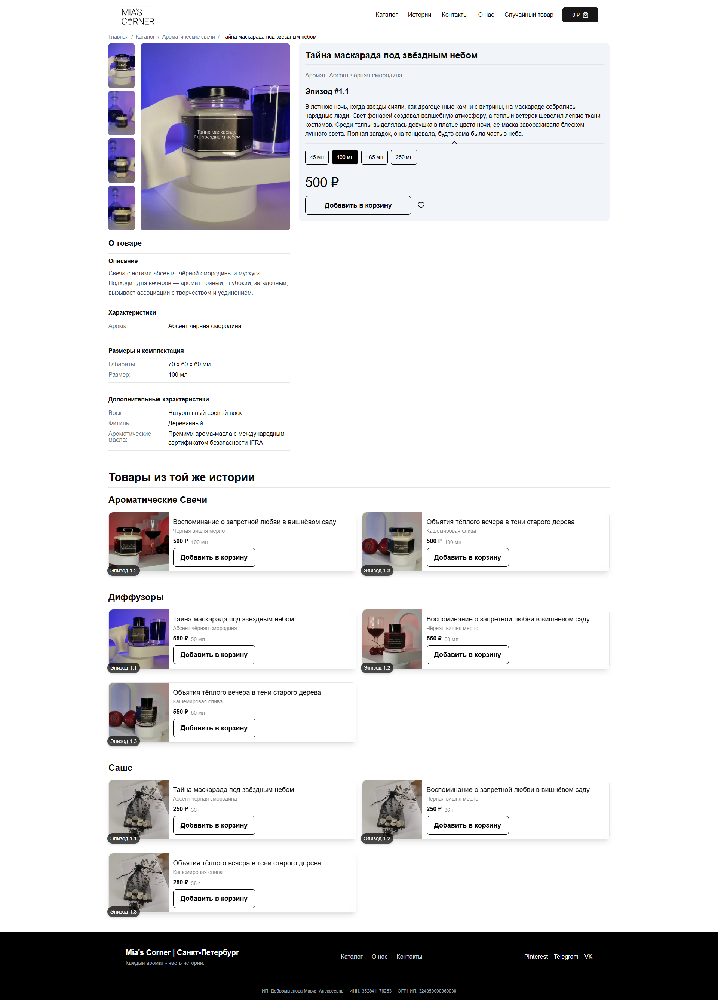
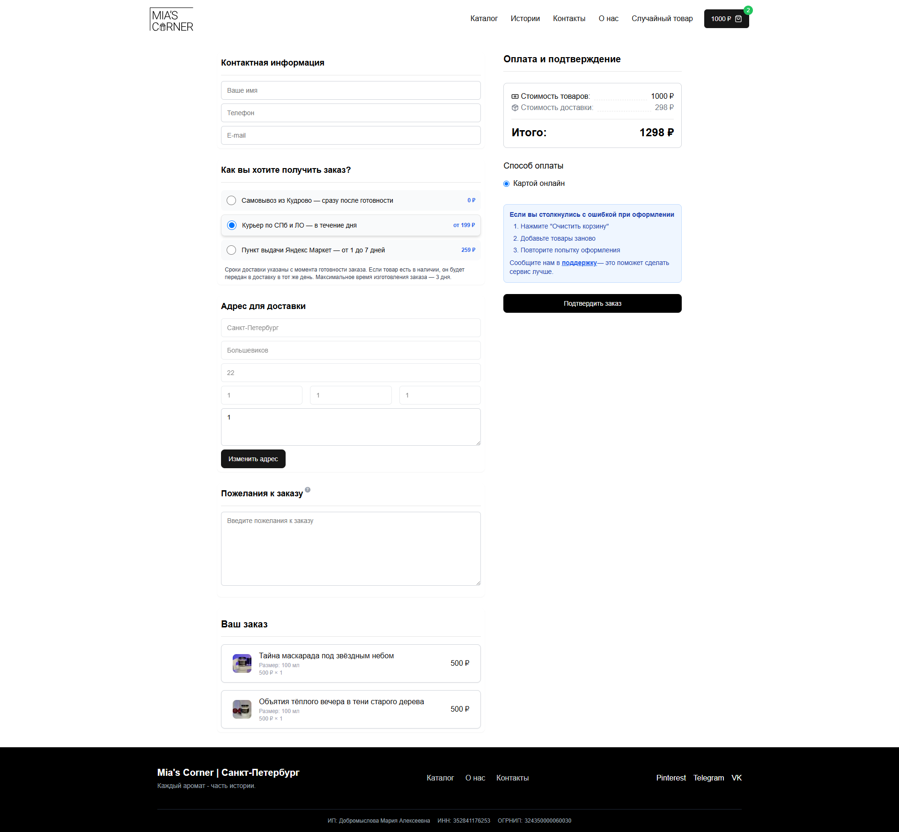

# 🕯️ mia-s-corner

Демонстрационный e-commerce проект на Next.js с Supabase, кастомной корзиной, расчётом доставки через API Яндекс.Доставки и email-уведомлениями с помощью Resend. Оптимизирован для SEO и мобильных устройств.

---

## 📖 Обзор

**mia-s-corner** — демонстрационный full-stack e-commerce проект на Next.js (App Router) с Supabase в роли BFF и базы данных, а также React-фронтендом со стейт-менеджментом на основе Zustand и SWR. Пользователи могут просматривать каталог товаров по категориям, выбирать размеры, добавлять товары в корзину, рассчитывать доставку через API Яндекс.Доставки и оформлять заказы с email-уведомлениями через Resend API. Администратор может добавлять новые товары и отслеживать статистику по товару.

---

## ✨ Функциональность

- Каталог товаров с категориями и историями
- Карточка товара с галереей, составом и размерами
- Корзина: добавление/удаление, хранение в Supabase и LocalStorage
- Расчёт стоимости доставки через API Яндекс.Доставки
- Оформление заказов с email-уведомлениями через Resend API
- Админ-панель с формой добавления товаров
- Полностью адаптивный интерфейс
- SEO-оптимизация страниц и данных

---

## 🛠 Технологии

- **Фреймворк:** Next.js (App Router)
- **База данных:** Supabase
- **Стилизация:** Tailwind CSS, shadcn/ui
- **Состояние:** Zustand, SWR
- **Валидация:** Zod, React Hook Form
- **Email-уведомления:** Resend API
- **Расчёт доставки:** Yandex Delivery B2B API
- **Анимации:** Framer Motion
- **UI-компоненты:** Lucide-React, Embla Carousel

---

## 🏗 Архитектура

```
Browser
   ⬍
Next.js App (SSR/API Routes)
   ⬍
Supabase (DB)
```

---

## 🚀 Быстрый старт

### Требования

- Node.js ≥18
- npm или yarn
- Аккаунт в [Supabase](https://supabase.com/)
- API ключи от Yandex Delivery и Resend

### Установка

```bash
git clone https://github.com/lanovich/mia-s-corner.git
cd mia-s-corner
npm install
```

Создайте `.env.local`:

```dotenv
NEXT_PUBLIC_SUPABASE_URL=ваш-url
NEXT_PUBLIC_SUPABASE_ANON_KEY=ваш-anon-key
SUPABASE_SERVICE_KEY=ваш-service-key

RESEND_API_KEY=ваш-resend-api-key
YANDEX_DELIVERY_TOKEN=ваш-yandex-api-token
```

### Запуск

```bash
npm run dev
```

---

## 📂 Структура проекта

```
src/
 ├── app/            # Страницы и маршруты
 ├── components/     # Повторно используемые UI-компоненты
 ├── lib/            # Утилиты и Supabase клиент
 ├── services/       # Работа с корзиной, заказами и API
 ├── store/          # Zustand-стейты и кастомные хуки
 ├── types/          # Типы TypeScript
 └── middleware.ts   # Middleware для защиты маршрутов
```

---

## 💾 Модели данных (Supabase)

| Таблица      | Назначение                              |
| ------------ | --------------------------------------- |
| `users`      | Пользователи                            |
| `roles`      | Роли пользователей                      |
| `products`   | Товары (название, описание, фото, цена) |
| `categories` | Категории товаров                       |
| `history`    | Истории изменений по товарам            |
| `cart`       | Корзина пользователя                    |
| `orders`     | Оформленные заказы                      |

---

## 🔧 Переменные окружения

| Переменная                    | Назначение                            |
| ----------------------------- | ------------------------------------- |
| NEXT_PUBLIC_SUPABASE_URL      | URL проекта Supabase                  |
| NEXT_PUBLIC_SUPABASE_ANON_KEY | Публичный Supabase ключ               |
| SUPABASE_SERVICE_KEY          | Приватный сервисный ключ Supabase     |
| RESEND_API_KEY                | Ключ API Resend для email-уведомлений |
| YANDEX_DELIVERY_TOKEN         | Ключ API Яндекс.Доставки              |

---

## 🌐 Сторонние API

### 📬 Resend API

Resend используется для отправки email при оформлении заказа.

Пример запроса:

```ts
POST https://api.resend.com/emails
Authorization: Bearer <RESEND_API_KEY>
```

### 🚚 Yandex Delivery API

Yandex Delivery используется для получения стоимости и сроков доставки.

Документация: [https://b2b.taxi.yandex.ru/docs/](https://b2b.taxi.yandex.ru/docs/)

---

## 🔍 SEO-оптимизация

- SSR/SSG-рендеринг большинства страниц
- Динамическая генерация мета-тегов (`<title>`, `<meta>`)
- Поддержка Structured Data (JSON-LD)
- `sitemap.xml` и `robots.txt` (через `next-sitemap`)
- Оптимизация изображений через `next/image`
- Семантически корректная верстка и адаптивность

---

## 📸 Скриншоты

```md





```

---

## 🤝 Как внести вклад

1. Сделайте форк проекта
2. Создайте новую ветку: `git checkout -b feature/название`
3. Внесите изменения и закоммитьте: `git commit -m "описание"`
4. Откройте Pull Request

---

## 📬 Контакты

Автор: [lanovich](https://github.com/lanovich)  
Вопросы и баги — через GitHub Issues.
